# Procesverslag
Markdown is een simpele manier om HTML te schrijven.  
Markdown cheat cheet: [Hulp bij het schrijven van Markdown](https://github.com/adam-p/markdown-here/wiki/Markdown-Cheatsheet).

Nb. De standaardstructuur en de spartaanse opmaak van de README.md zijn helemaal prima. Het gaat om de inhoud van je procesverslag. Besteedt de tijd voor pracht en praal aan je website.

Nb. Door *open* toe te voegen aan een *details* element kun je deze standaard open zetten. Fijn om dat steeds voor de relevante stuk(ken) te doen.

## Jij, Kyara Frankena

  
uitwerken voor kick-off werkgroep

  ### Auteur:
  Kyara Frankena 

  #### Je startniveau:
  Mijn startniveau is blauw/rood 

  #### Je focus:
  Surface plane 
 

## Je website

  
uitwerken voor kick-off werkgroep

  ### Je opdracht:
  https://www.heineken.com/nl/nl/home

  #### Screenshot(s) van de eerste pagina (small screen): 
  hier de naam van de pagina  
  

  #### Screenshot(s) van de tweede pagina (small screen):
  hier de naam van de pagina  
  
 

## Toegankelijkheidstest 1/2 (week 1)

  
uitwerken na test in 1e werkgroep

  ### Bevindingen
  Testen heb ik uitgevoerd samen met Frank. 

  #### Screenreader
  Test met voice over:
  Als je tabt door de website leest hij alles voor. 
  De voice over werkt naar toebehoren.

  #### Muis en Toetsenbord 
  Test met de tab: 
    Je kan geheel doorheen tabben. 
    De tab gaat ook door in de socials en het logo.
    Alleen in de swipe content werkt hij minder goed.
    Talen pakt hij niet bij het tabben.

  #### Motoriek (shocks, elastiekjes)
  Testen met shocks:
    Je klikt al sneller op de afbeeldingen zonder dat je het wilt. 
    Je hebt vrijwel slechte controle op de website. 

  #### Visueel (brillen, contrast, kleurenblind, dark/light). 
  Testen met kleuren en blurren:
    Kleur is wel essentieel, vooral omdat je die kleuren bent gewend bij Heineken.
    Bij het blurren is de kleine tekst niet meer leesbaar, de grote koppen zijn nog te doen.

## Breakdownschets (week 1)

  
uitwerken na afloop 2e werkgroep

  ### de hele pagina: 
  

  ### dynamisch deel (bijv menu): 
  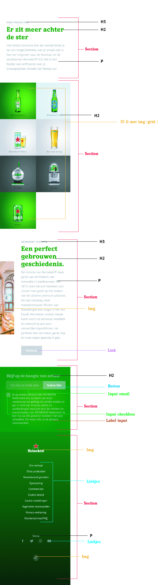

  ### wellicht nog een dynamisch deel (bijv filter): 
  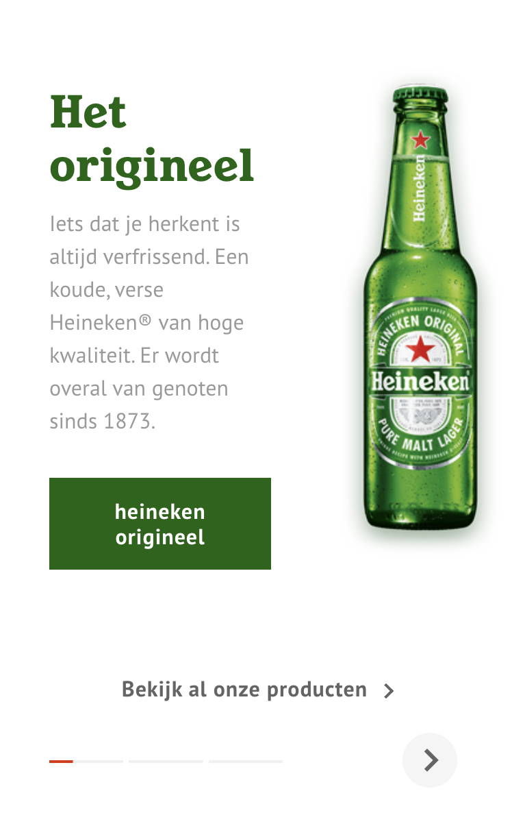

## Voortgang 1 (week 2)

  
uitwerken voor 1e voortgang

  ### Stand van zaken
  Momenteel heb ik mij voornamelijk gefocusd op mijn html code en heb ik hiervoor een opzetje gemaakt. 
  Verder ben ik nog niet begonnen in mijn css. Na dit gesprek met de studentassistenten hoop ik te weten of ik 
  op de juiste weg bezig ben, waar ik nog wat aanpassingen nodig heb en of ik redelijk bij loop.

  Voor het binnen komen in het lokaal zouden wij met ons groepje bespreken waar wij allemaal zouden staan, 
  helaas ging dit anders dan gepland en is de helft niet komen opdagen tijdens dit moment. Jade en ik waren een half
  uurtje van tevoren wel aanwezig, alleen gaf zij aan nog niet veel werk te hebben (html) omdat zij daar niet uit kwam. 
  Het maken van afspraken/punten met mijn groepje is deze week dan ook anders gelopen dan verwacht, wat ik persoonlijk
  erg jammer vind...

  ### Agenda voor meeting
  samen met je groepje opstellen

  | student 1 (Kyara) | student 2 (Jade) | student 3 (Silke) | student 4 (Suneyska) |
  | ---               | ---              | ---               | ---                  |
  | Vragen of mijn    | Vragen over haar | Niet aanwezig     | Niet aanwezig
  code semantisch     | menu hoe dit te  | tijdens gesprek   | tijdens gesprek
  kloppend is.        | doen in html?
                      | Andere website?

  ### Verslag van meeting
Feedback vanuit de studentassistenten na het gesprek:
  - Html code is goed semantisch geschreven.
  - Kijk nog even naar de volgorde met h2,h3,h4 en je img. Dus eerst je tekstelementen en dan je img. 
  - Ga thuis veel stappen maken, veel gaan schrijven en dan in de les je vragen stellen.

## Voortgang 2 (week 3)

  
uitwerken voor 2e voortgang

  ### Stand van zaken
  Helaas was er deze week een herhaling van afgelopen week, maar nu zo erg dat ik in mijn eentje ben over gebleven bij 
  het bespreken van mijn website in de klas. Als groepje spreken (althans dan zouden we doen) we een half uur voor het 
  check moment af in de medialounge om elkaars werk te zien, eventuele verbeterpunten door te geven en samen te kijken 
  waar iedereen momenteel staat. Heb bijna het idee dat ik in herhaling val, maar dat is dus NIET gebeurt. Wel heb ik er 
  zelf naar gekeken maar goed dat doe ik inmiddels al 2 weken.
  Vervolgens heb ik samen met Sanne, alle tijd gehad om te kijken naar mijn website. De vragen te stellen  die ik op 
  dat moment had (vooral over mijn eerste section die ik niet goed gepositioneerd kreeg) en ben ik een stuk wijzer
  geworden hoe ik het kon aanpakken voor de weken erna. 

  ### Agenda voor meeting
  samen met je groepje opstellen

  | student 1 (Kyara)   | student 2  (Jade)    | student 3  (Silke) | student 4 (Suneyska) |
  | ---                 | ---                  | ---                | ---              |
  | De vraag hoe ik     | Heeft zich vanwege   | Niet aanwezig      | Niet aanwezig
  de diverse elementen  | storing trein        | tijdens gesprek    | tijdens gesprek
  in mijn eerste        | samengevoegd met de  |
  section goed          | volgende groep.      |
  gepositioneerd        |           
  kan krijgen.          |

           

  ### Verslag van meeting

Feedback vanuit Sanne na het gesprek:
  - meer code gaan schrijven.
  - soms logisch nadenken hoe je iets aanspreekt.
  - durven fouten te maken.

## Toegankelijkheidstest 2/2 (week 4)

  
uitwerken na test in 8e werkgroep

  ### Bevindingen
  Wederom heb ik deze testen uitgevoerd samen met Frank. 
  Hieronder zal ik een conclusie beschrijven.

  Door middel van het testen met de screenreader ben ik erachter gekomen dat sommige linkjes tekstueel nog niet juist zijn.
  De kans is dus groot dat dit ook niet goed gaat op hun eigen site.

  Kleuren voor een website kunnen essentieel zijn om het te begrijpen maar merkte al snel dat mocht je echt al lang kleurenblind zijn dit niet een probleem is om niet te kunnen weten waar het over gaat. Het is informatief sterk.

  De buttons en linkjes zijn allemaal op zo danige grootte dat het klikbaarheid geen problemen hoeft te bezorgen.
  Kortom op veel mogelijke manieren getest en er goed uitgekomen, in tegenstelling tot de rommelige code van heineken 
  zelfs soms op hun eigen site.  

  #### Screenreader
  De screenreader heb ik getest op zowel linkjes als kopjes. 
  Die werken allemaal wel. Merk alleen dat als je kijkt naar sommige linkjes de teksten niet helemaal relevant zijn 
  als je de screenreader gebruikt. Dus daar kan ik wel iets in veranderen en zorgen dat dit dus wel direct duidelijk word.
  Bijvoorbeeld dat de teksten in de linkjes niet duidelijk genoeg zijn zodra ze worden voorgelezen met een screenreader. 

  #### Muis en Toetsenbord 
  Website is wel tabbaar, alleen 1 button moet ik nog aanpassen die werkt niet binnen mijn html/css.
  Bij blurred is de p tekst vrijwel niet meer leesbaar. De kleuren en afbeeldingen blijven nog wel herkenbaar.
  Bij het veranderen van de kleuren blijft alles wel leesbaar en begrijpelijk. Het enige wat je merkt is dat 
  de kleuren van het merk waardoor je direct weet wat het is niet meer te vinden is (zwart-wit, blauwtinten etc.). 
  Ondanks dat is de website nog prima in gebruik. 
  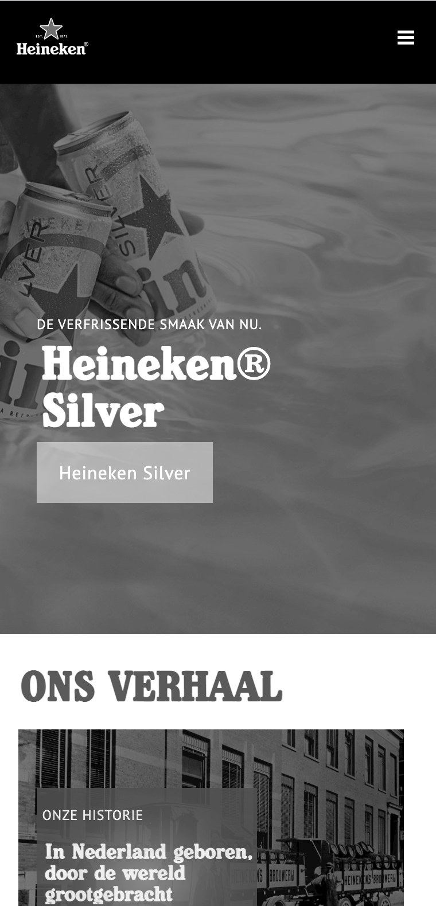
  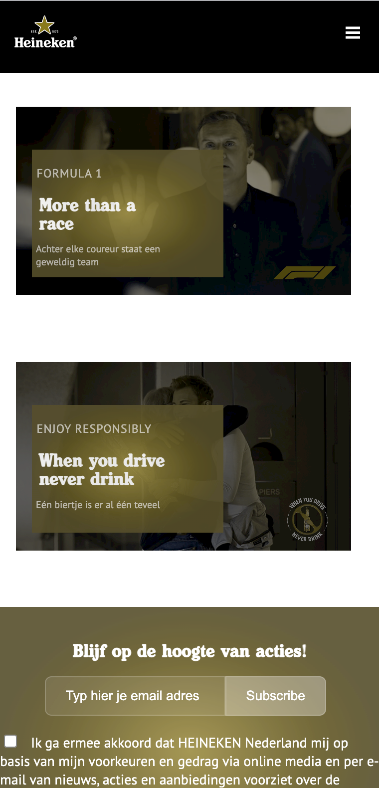
  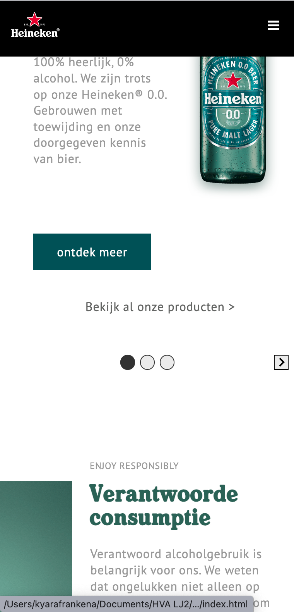

  #### Motoriek (shocks, elastiekjes)
  De website is goed toegangelijk met het hebben van parkinson. Om de muis te kunnen gebruiken is het wel wat moeilijker
  maar mijn testpersoon zelf heeft ook het idee dat als je parkinson hebt je meer je tab of pijltjes zal gebruiken  i.p.v.
  je muis. De buttons zijn groot genoeg om te kunnen klikken, kortom werkt prima.

  #### Visueel (brillen, contrast, kleurenblind, dark/light). 
  Geeltinten: Kleuren van mijn website worden anders, maar leesbaarheid&herkenbaarheid blijft.
  Periphereal field loss: Het is goed te zien, alleen zodra je langere teksten hebt word het moeilijker om te kunnen lezen.
  Combined loss: Het is goed te zien, alleen vanaf een afstandje begint het moeilijker te worden.
  Low contrast: Leesbaarheid van testen minder, kleuren veranderen hier en daar
  blur: Alles wordt wazig, logisch. Je ziet wel kleuren maar kan niet definieren wat er staat. Het word moeilijker om de 
  website te begrijpen.
  Hemifield loss: Goed zichtbaar, niet echt problemen bij het bekijken van mijn website.
  Central field loss: Ondanks de zwarte stip in het midden is de website nog duidelijk te lezen. Je kan naast de stip kijken en vinden wat je zoekt.
  

## Voortgang 3 (week 4)

  
uitwerken voor 3e voortgang

  ### Stand van zaken
  Momenteel ben ik een paar dagen voor de uiteindelijke deadline beland. Merk ik dat ik aardig goed op weg ben, maar de 
  laatste loodjes nog wel wat tijd gaan innemen ben ik bang. Soms merk ik dat er kleine foutjes ergens aanwezig zouden 
  moeten zijn die ik niet kan oplossen, daar even de tijd voor moet nemen en het uiteindelijk dan toch vind. Kortom
  rustig blijven kijken en dan kom je er wel.
  Elementen blijken soms niet helemaal goed gekoppeld te zijn dus hier heb ik dan ook op het laatste moment in de klas
  nog wel wat vragen over zodat ik dit weekend het zelf kan afronden en inleveren. 

  ### Agenda voor meeting
  samen met je groepje opstellen

  | student 1 (Kyara)  | student 2 (Jade)    | student 3 (Silke)  | student 4 (Suneyska) |
  | ---                | ---                 | ---                | ---                  |
  | button met img     | Items naast elkaar, | Niet aanwezig      | Niet aanwezig
  | clickable maken &  | footer voor elkaar  | tijdens gesprek    | tijdens gesprek
  | hoe p toevoegen in | krijgen.            |
  | grid?              |

  ### Verslag van meeting
  hier na afloop snel de uitkomsten van de meeting vastleggen

  - Mega goed geholpen door de studentenassisten (applaus) die de fout in mijn code hebben gevonden.
  - Kreeg zelfs complimenten over wat ik al had gemaakt.
  - Github up-to-date houden.
  - Was een fijn gesprek, we hielpen elkaar waar nodig en dat werkte helemaal top. 

## Eindgesprek (week 5)

  
uitwerken voor eindgesprek

  ### Je uitkomst - karakteristiek screenshots:
  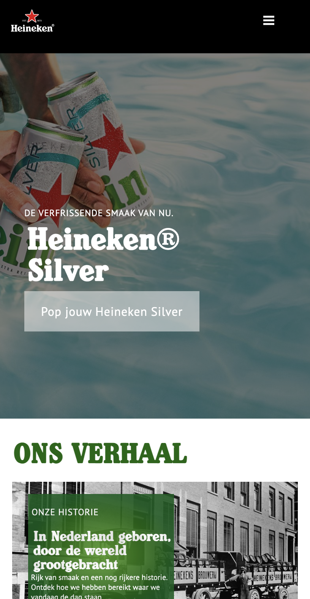
  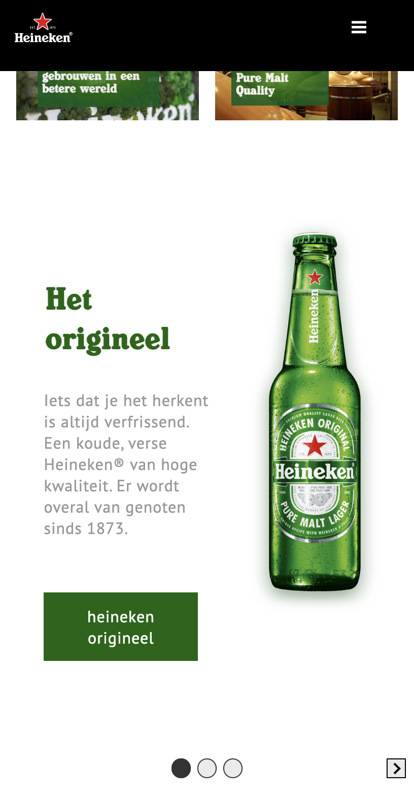
  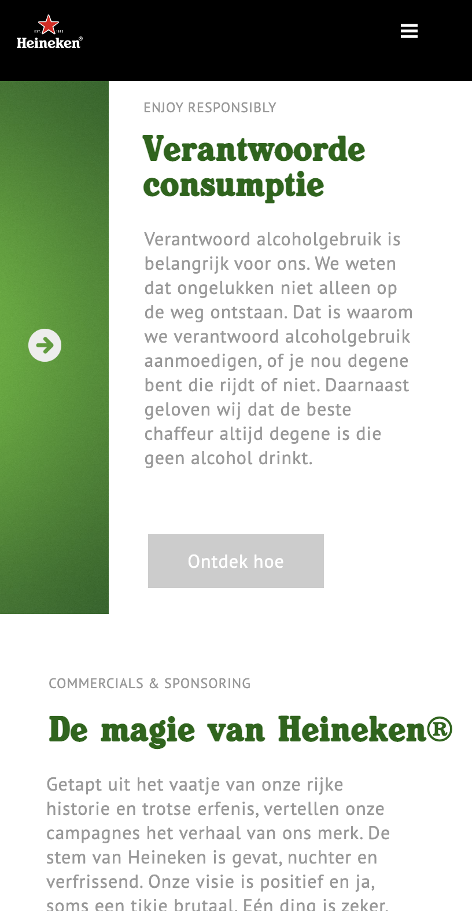
  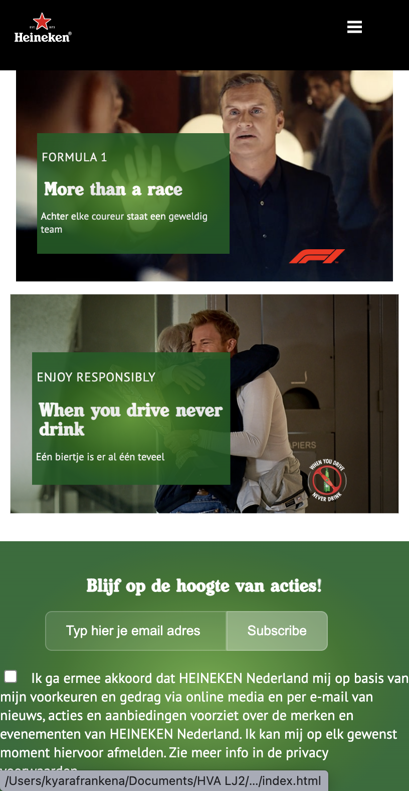
  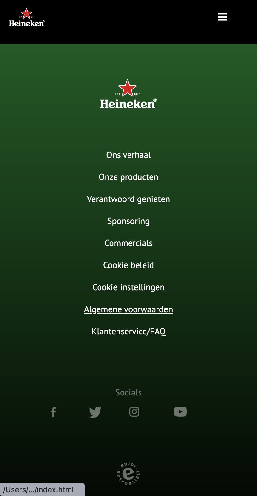

  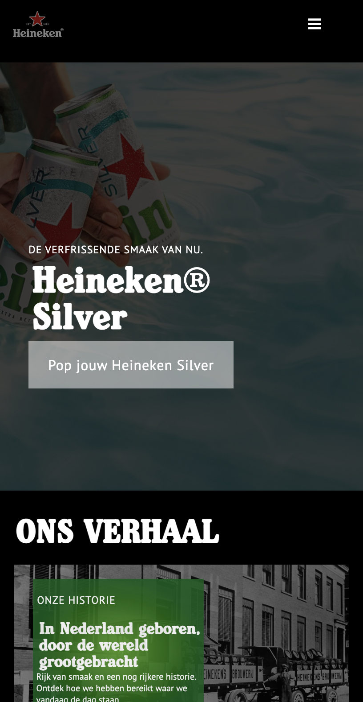
  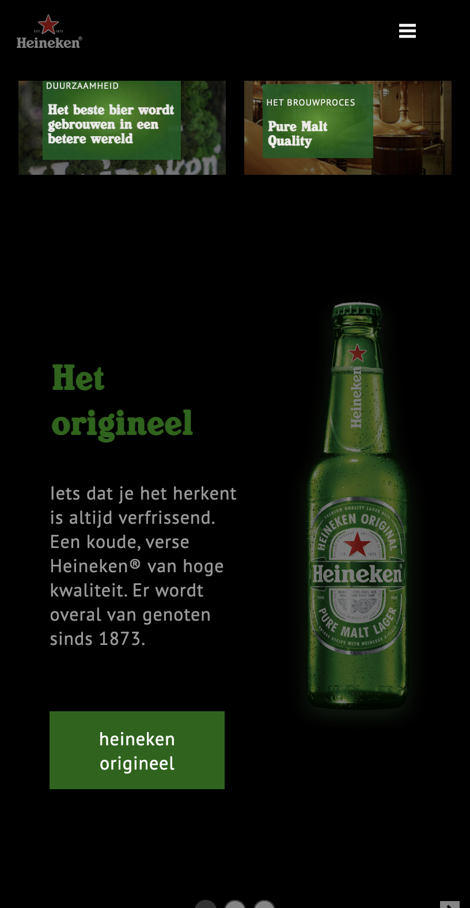
  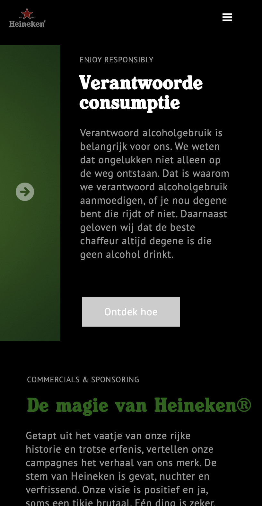
  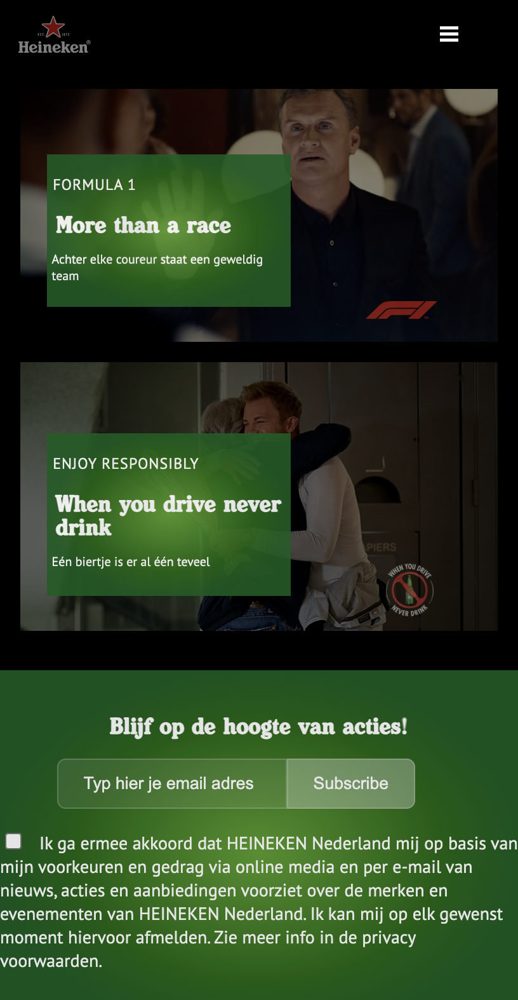

  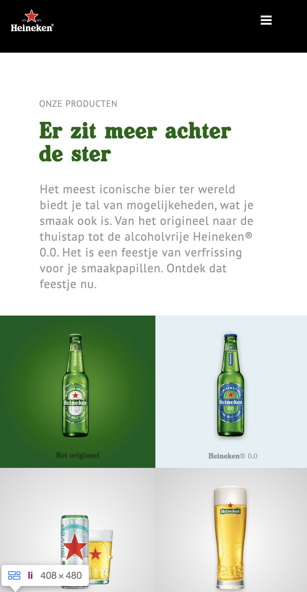
  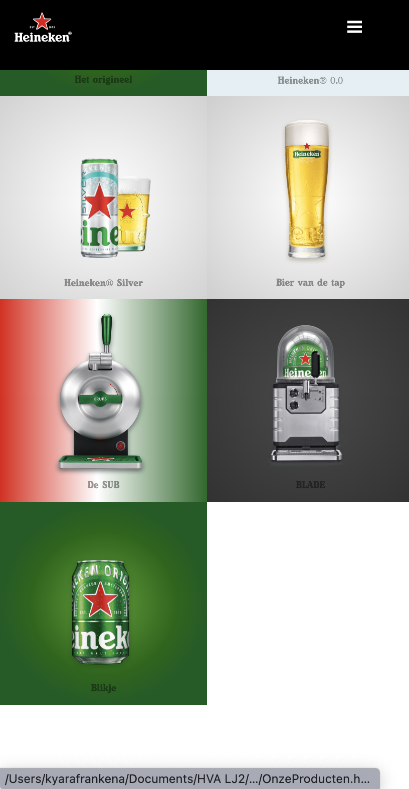
  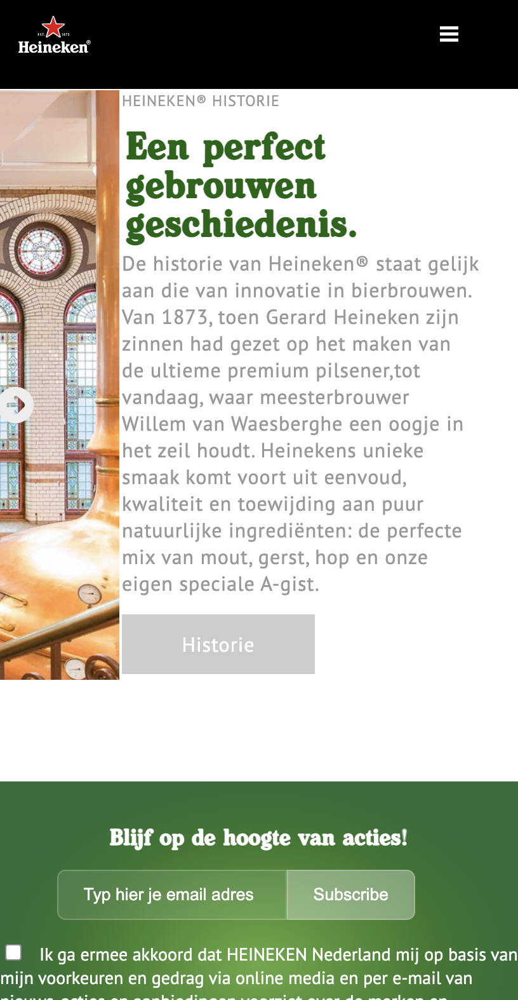

  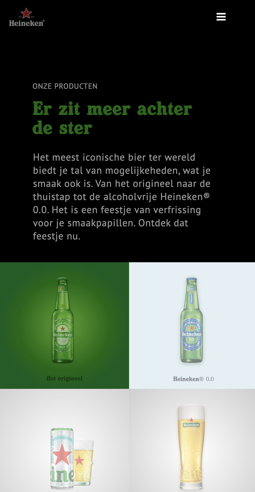
  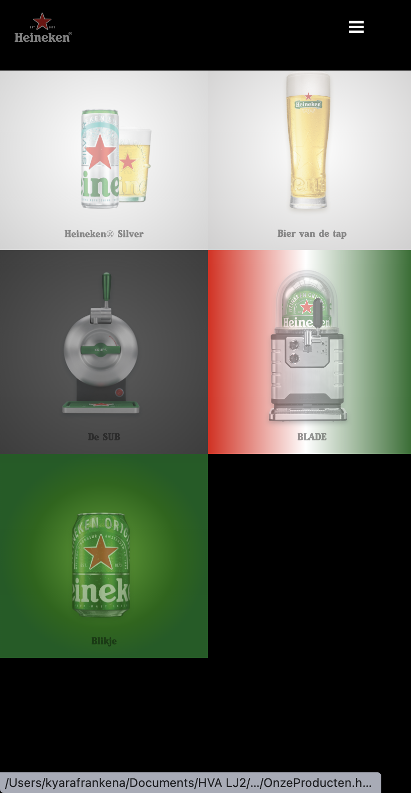
  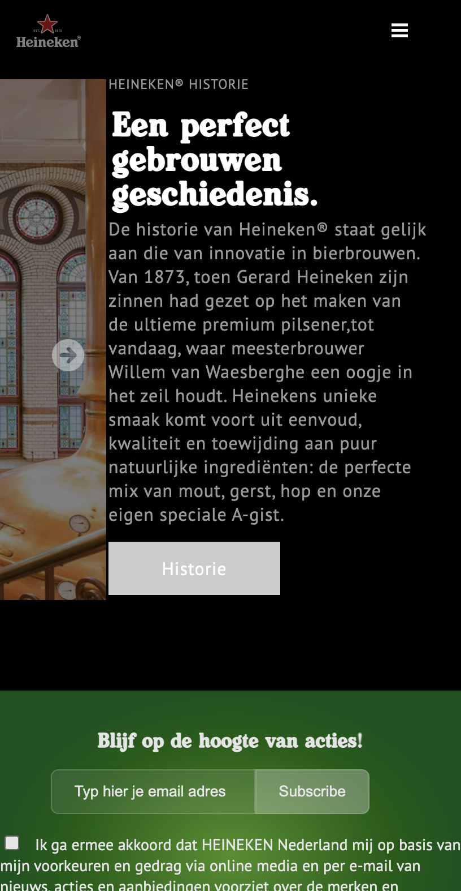

  ### Dit ging goed/Heb ik geleerd: 
  Deze opdracht is bij mij echt volledig in fases gegaan. Aan het begin had ik zelfs moeite met het bedenken hoe de 
  DOM ook alweer precies in elkaar zat (denk iets met vakantiemodus nog aan in mijn hoofd) terwijl toen ik eenmaal
  lekker aan het schrijven was merkte ik dat het ook wel weer snel/soepel verliep en kon ik de elementen zo op z'n
  plek zetten. Wel zaten er wat dingen in die ik nog nooit had gecodeerd maar gelukkig was er genoeg ondersteuning 
  vanuit de docent, studenassistenten en mede-studenten om daarbij in oplossingen te denken. 

  Het meeste wat ik heb geleerd is het combineren van verschillende elementen, op een manier te coderen waarbij je
  zo min mogelijk divjes/classes mag gebruiken en het werken met diverse animatie onderdelen. Veel geleerd in 4 weken tijd
  die ik zeker kan meenemen verder in dit jaar (toekomst).

  ### Dit was lastig/Is niet gelukt:
  Hetgeen wat ik hier en daar moeilijker vond is het overal responsive krijgen van de diverse onderdelen.
  Heb dat ook nog nooit gedaan dus denk dat ik in het algemeen ergens een foutje maak of niet direct weet hoe ik dat 
  moet aanspreken om het responsive te krijgen. Dat zou ik in de toekomst nog wel willen leren om mijn kennis zo 
  onder andere nog meer te verbreden.

## Bronnenlijst

  
continu bijhouden terwijl je werkt

  Nb. Wees specifiek ('css-tricks' als bron is bijv. niet specifiek genoeg).

  1. Niet zozeer dat ik iets van code van de website heb kunnen kopieren en plakken maar voornamelijk kennis van 
     het grid en hoe te gebruiken heb ik hier vandaan kunnen halen 
     https://css-tricks.com/snippets/css/complete-guide-grid/
  2. Natuurlijk de website van Heineken, waarvan ik vrijwel alle content heb gehaald om er zo voor te zorgen dat 
     mijn website zo goed mogelijk op de echte versie zal lijken.
     https://www.heineken.com/nl/nl/home
  3. Freepik, voor het hebben van de social media icons. Dit is een website die dit rechtenvrij aanbiedt. 
     https://www.freepik.com/free-vector/social-media-logo-collection_3899143.htm#query=instagram%20icon&position=2&from_view=search#position=2&query=instagram%20icon
  4. Code van Sanne vanuit codepen, denk hierbij aan het realiseren van mijn carrousel, maar ook het laten werken van 
     mijn menuknop die van 3lijnen veranderd in een kruisje en weer terug. 
  5. The noun project voor een pijl die open kan klappen. Tweemaal nodig op mijn website. 
    https://thenounproject.com/icon/arrow-3134103/
  6. Om mijn geluidje toe te kunnen voegen heb ik een mp3 op de volgende website gedownload. Een geluid dat klinkt 
    als het openen van een Heineken Silver.
    https://nl.dreamstime.com/royalty-vrije-muziek-bierfles-het-openen-audio117794173
  7. Omdat ik ook een kerstthema heb meegegeven aan mijn tweede pagina, had ik een icoontje nodig. Die heb ik 
     bij de website van Nounproject gevonden.
     https://thenounproject.com/icon/christmas-1999757/
  8. Naast bovenstaande bronnen heb ik de afgelopen weken hulp gekregen van Sanne, Yara en Russel. In combinatie met 
     hun hulp heb ik de website kunnen maken wat ik nu heb ingeleverd. :)

