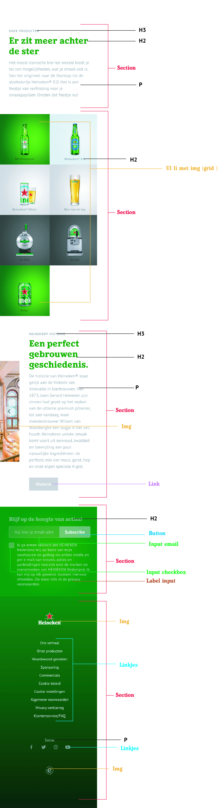
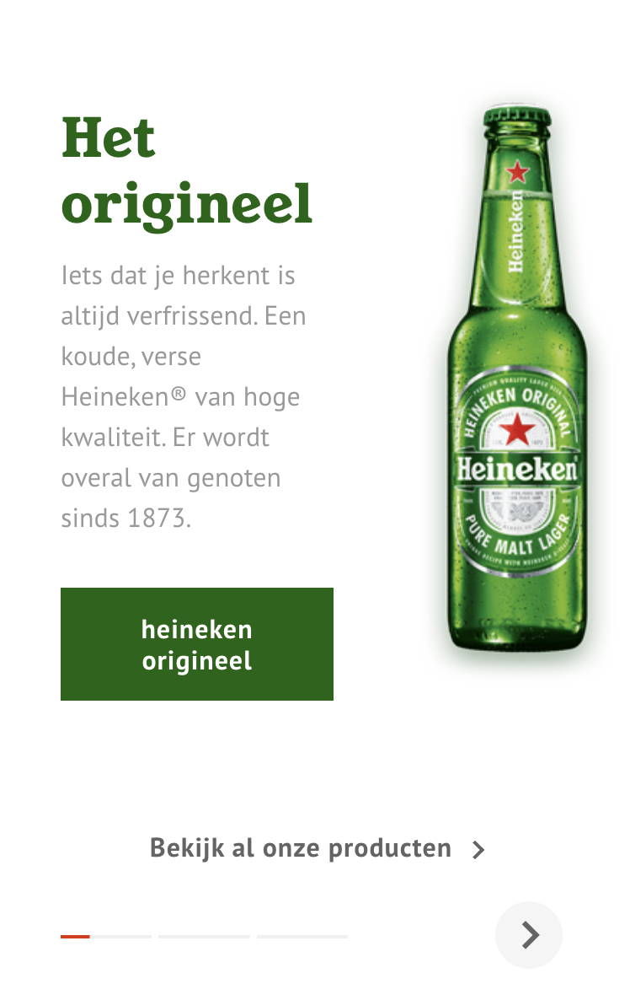

# Procesverslag
Markdown is een simpele manier om HTML te schrijven.  
Markdown cheat cheet: [Hulp bij het schrijven van Markdown](https://github.com/adam-p/markdown-here/wiki/Markdown-Cheatsheet).

Nb. De standaardstructuur en de spartaanse opmaak van de README.md zijn helemaal prima. Het gaat om de inhoud van je procesverslag. Besteedt de tijd voor pracht en praal aan je website.

Nb. Door *open* toe te voegen aan een *details* element kun je deze standaard open zetten. Fijn om dat steeds voor de relevante stuk(ken) te doen.

## Jij, Kyara Frankena

  
uitwerken voor kick-off werkgroep

  ### Auteur:
  Kyara Frankena 

  #### Je startniveau:
  Mijn startniveau is blauw/rood (kies uit zwart, rood óf blauw)

  #### Je focus:
  Surface plane (kies uit responsive óf surface plane)
 

## Je website

  
uitwerken voor kick-off werkgroep

  ### Je opdracht:
  https://www.heineken.com/nl/nl/home

  #### Screenshot(s) van de eerste pagina (small screen): 
  hier de naam van de pagina  
  

  #### Screenshot(s) van de tweede pagina (small screen):
  hier de naam van de pagina  
  
 

## Toegankelijkheidstest 1/2 (week 1)

  
uitwerken na test in 1e werkgroep

  ### Bevindingen
  Testen heb ik uitgevoerd samen met Frank. 

  #### Screenreader
  Test met voice over:
  Als je tabt door de website leest hij alles voor. 
  De voice over werkt naar toebehoren.

  #### Muis en Toetsenbord 
  Test met de tab: 
    Je kan geheel doorheen tabben. 
    De tab gaat ook door in de socials en het logo.
    Alleen in de swipe content werkt hij minder goed.
    Talen pakt hij niet bij het tabben.

  #### Motoriek (shocks, elastiekjes)
  Testen met shocks:
    Je klikt al sneller op de afbeeldingen zonder dat je het wilt. 
    Je hebt vrijwel slechte controle op de website. 

  #### Visueel (brillen, contrast, kleurenblind, dark/light). 
  Testen met kleuren en blurren:
    Kleur is wel essentieel, vooral omdat je die kleuren bent gewend bij Heineken.
    Bij het blurren is de kleine tekst niet meer leesbaar, de grote koppen zijn nog te doen.

## Breakdownschets (week 1)

  
uitwerken na afloop 2e werkgroep

  ### de hele pagina: 
  

  ### dynamisch deel (bijv menu): 
  

  ### wellicht nog een dynamisch deel (bijv filter): 
  

## Voortgang 1 (week 2)

  
uitwerken voor 1e voortgang

  ### Stand van zaken
  Momenteel heb ik mij voornamelijk gefocusd op mijn html code en heb ik hiervoor een opzetje gemaakt. 
  Verder ben ik nog niet begonnen in mijn html. Na dit gesprek met de studentassistenten hoop ik te weten of ik 
  op de juiste weg bezig ben, waar ik nog wat aanpassingen nodig heb en of ik redelijk bij loop.

  Voor het binnen komen in het lokaal zouden wij met ons groepje bespreken waar wij allemaal zouden staan, 
  helaas ging dit anders dan gepland en is de helft niet komen opdagen tijdens dit moment. Jade en ik waren een half
  uurtje van tevoren wel aanwezig, alleen gaf zij aan nog niet veel werk te hebben (html) omdat zij daar niet uit kwam. 
  Het maken van afspraken/punten met mijn groepje is deze week dan ook anders gelopen dan verwacht, wat ik persoonlijk
  erg jammer vind...

  ### Agenda voor meeting
  samen met je groepje opstellen

  | student 1 (Kyara) | student 2 (Jade) | student 3 (Silke) | student 4 (Suneyska) |
  | ---               | ---              | ---               | ---                  |
  | Vragen of mijn    | Vragen over haar | Niet aanwezig     | Niet aanwezig
  code semantisch     | menu hoe dit te  | tijdens gesprek   | tijdens gesprek
  kloppend is.        | doen in html?
                      | Andere website?

  ### Verslag van meeting
Feedback vanuit de studentassistenten na het gesprek:
  - Html code is goed semantisch geschreven.
  - Kijk nog even naar de volgorde met h2,h3,h4 en je img. Dus eerst je tekstelementen en dan je img. 
  - Ga thuis veel stappen maken, veel gaan schrijven en dan in de les je vragen stellen.

## Voortgang 2 (week 3)

  
uitwerken voor 2e voortgang

  ### Stand van zaken
  Helaas was er deze week een herhaling van afgelopen week, maar nu zo erg dat ik in mijn eentje ben over gebleven bij 
  het bespreken van mijn website in de klas. Als groepje spreken (althans dan zouden we doen) we een half uur voor het 
  check moment af in de medialounge om elkaars werk te zien, eventuele verbeterpunten door te geven en samen te kijken 
  waar iedereen momenteel staat. Heb bijna het idee dat ik in herhaling val, maar dat is dus NIET gebeurt. Wel heb ik er 
  zelf naar gekeken maar goed dat doe ik inmiddels al 2 weken.
  Vervolgens heb ik samen met Sanne, alle tijd gehad om te kijken naar mijn website. De vragen te stellen  die ik op 
  dat moment had (vooral over mijn eerste section die ik niet goed gepositioneerd kreeg) en ben ik een stuk wijzer
  geworden hoe ik het kon aanpakken voor de weken erna. 

  ### Agenda voor meeting
  samen met je groepje opstellen

  | student 1 (Kyara)   | student 2  (Jade)    | student 3  (Silke) | student 4 (Suneyska) |
  | ---                 | ---                  | ---                | ---              |
  | De vraag hoe ik     | Heeft zich vanwege   | Niet aanwezig      | Niet aanwezig
  de diverse elementen  | storing trein        | tijdens gesprek    | tijdens gesprek
  in mijn eerste        | samengevoegd met de  |
  section goed          | volgende groep.      |
  gepositioneerd        |           
  kan krijgen.          |

           

  ### Verslag van meeting

Feedback vanuit Sanne na het gesprek:
  - meer code gaan schrijven
  - 

## Toegankelijkheidstest 2/2 (week 4)

  
uitwerken na test in 8e werkgroep

  ### Bevindingen
  Lijst met je bevindingen die in de test naar voren kwamen (geef ook aan wat er verbeterd is):

  #### Screenreader
  Hier korte omschrijving (met indien nodig afbeeldingen)

  Hier een omschrijving van hoe het opgelost kan worden (met indien nodig afbeeldingen)

  #### Muis en Toetsenbord 
  Hier korte omschrijving (met indien nodig afbeeldingen)

  Hier een omschrijving van hoe het opgelost kan worden (met indien nodig afbeeldingen)

  #### Motoriek (shocks, elastiekjes)
  Hier korte omschrijving (met indien nodig afbeeldingen)

  Hier een omschrijving van hoe het opgelost kan worden (met indien nodig afbeeldingen)

  #### Visueel (brillen, contrast, kleurenblind, dark/light). 
  Hier korte omschrijving (met indien nodig afbeeldingen)

  Hier een omschrijving van hoe het opgelost kan worden (met indien nodig afbeeldingen)

## Voortgang 3 (week 4)

  
uitwerken voor 3e voortgang

  ### Stand van zaken
  hier dit ging goed & dit was lastig (neem ook screenshots op van delen van je website en code)

  ### Agenda voor meeting
  samen met je groepje opstellen

  | student 1      | student 2          | student 3    | student 4        |
  | ---            | ---                | ---          | ---              |
  | dit bespreken  | en dit             | en ik dit    | en dan ik dat    |
  | en dat ook nog | dit als er tijd is | nog een punt | dit wil ik zeker |
  | ...            | ...                | ...          | ...              |

  ### Verslag van meeting
  hier na afloop snel de uitkomsten van de meeting vastleggen

  - punt 1
  - punt 2
  - nog een punt
  - ...

## Eindgesprek (week 5)

  
uitwerken voor eindgesprek

  ### Je uitkomst - karakteristiek screenshots:
  

  ### Dit ging goed/Heb ik geleerd: 
  Korte omschrijving met plaatjes

  

  ### Dit was lastig/Is niet gelukt:
  Korte omschrijving met plaatjes

  

## Bronnenlijst

  
continu bijhouden terwijl je werkt

  Nb. Wees specifiek ('css-tricks' als bron is bijv. niet specifiek genoeg).

  1. bron 1
  2. bron 2
  3. ...

